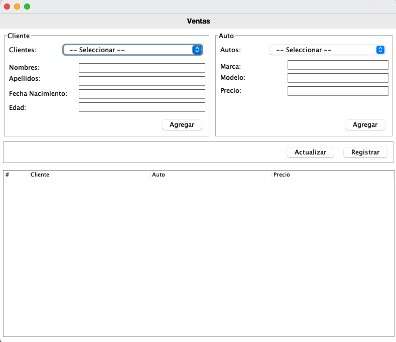
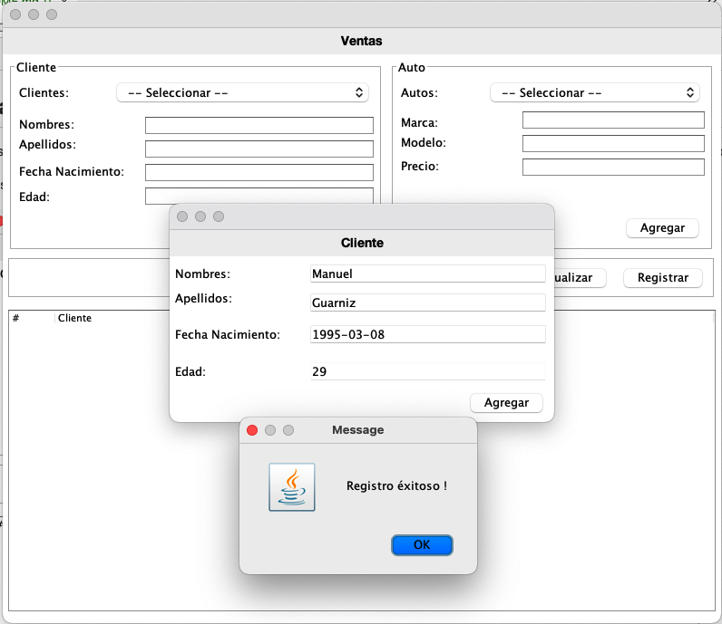
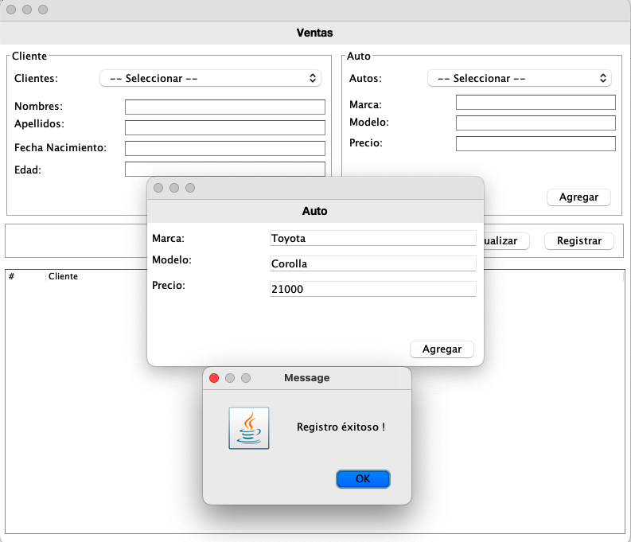
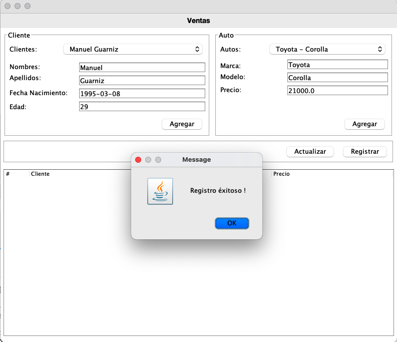
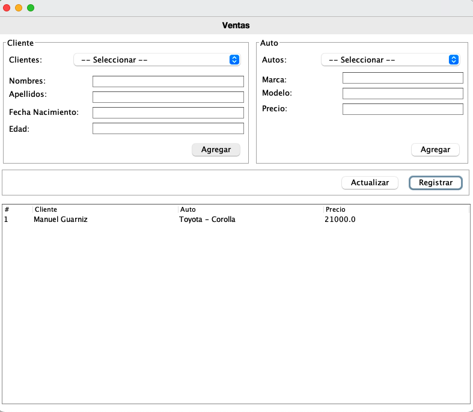

# Java Basic Projects

Sistema, permite el registro de clientes, autos. Para posteriormente seleccionar entre estos y realizar el registro de una venta simple.

Los procesos de actualizacion son automaticos.

## Ventanas

#### Principal

#### Registro de Cliente

#### Registro de auto

#### Registro de venta

#### Resumen de venta

